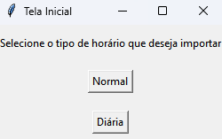
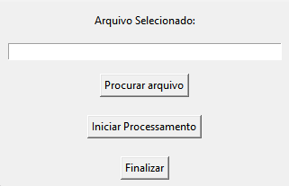
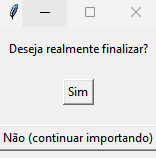


# Programa de Importação de Horário

  

## Descrição Geral

  

Este software em Python foi desenvolvido para processar e importar horários de um arquivo CSV, realizando uma série de tratamentos e organizando os dados para facilitar sua inserção em um banco de dados. A aplicação envolve a leitura e organização de dados, a adição de identificadores auto-incrementados, a conversão de formatos de horário, e a geração de instruções SQL para inserção dos dados em uma base de dados.

  

## Como Executar

  

Para facilitar a execução do software, você tem duas opções: clonar o repositório e executar o código fonte ou utilizar um executável (.exe).

  

### Opção 1: Clonar o Repositório e Executar o Código Fonte

  

#### Passo 1: Clonar o Repositório

  

1.  **Pré-requisitos:**

- Git instalado na sua máquina.

- Python 3.x instalado.

2.  **Comandos:**

```

# Clonar o repositório

git clone https://github.com/vinimeurer/importacao-horarios.git

# Navegar até o diretório do projeto

cd ./importacao-horarios/normal/

```

  

#### Passo 2: Instalar Dependências

  

1.  **Criar um ambiente virtual (opcional, mas recomendado):**

  

```

# Criar um ambiente virtual

python -m venv venv

  

# Ativar o ambiente virtual (No Windows)

venv\Scripts\activate

  

# Ativar o ambiente virtualNo macOS/Linux

source venv/bin/activate

```

  

2.  **Instalar as dependências necessárias:**

  

```

pip install -r requirements.txt

```

  

#### Passo 3: Executar o Código

  

1.  **Executar o arquivo principal:**

  

```

python main.py

```

  

### Opção 2: Utilizar o Executável (.exe)

  

1.  **Pré-requisitos:**

- Apenas o sistema operacional Windows é necessário.

2.  **Passo 1: Baixar o Executável:**

- Baixe o arquivo executável (`ImportacaoHorario.exe`) do repositório ou de onde ele estiver disponibilizado.

3.  **Passo 2: Executar o Arquivo:**

- Navegue até a pasta onde o arquivo `.exe` foi baixado.

- Clique duas vezes no arquivo `ImportacaoHorario.exe` para iniciar o software.

  

## Requisitos

  

-  **Linguagem de Programação:**

- Python 3.x

-  **Bibliotecas:**

-  `csv` para manipulação de arquivos CSV.

-  `os` e `shutil` para operações de sistema de arquivos.

-  `tkinter` para a interface gráfica.

-  `chardet` para detecção de codificação de arquivos.

-  `io` para manipulação de arquivos com codificação específica.

-  **Outros Requisitos:**

- Acesso a um arquivo CSV com os dados de horários.

- Ambiente capaz de executar scripts Python.

  
## Como funciona

### 1. Tela inicial
A tela inicial da aplicação apresenta duas opções para o usuário escolher o tipo de horário que deseja importar. Dependendo da escolha, diferentes processos serão executados.


 

- A partir disso, será possível selecionar um dos obtões:
	- **Normal:** Executa o código da classe `HorarioNormal`
	- **Diária:** Executa o código da classe `CargaDiaria`	

### 2. Tela de seleção de horário

Ao clicar em um dos botões na tela inicial, uma nova tela é aberta para selecionar o arquivo CSV e processar os dados. Esta tela contém:



**Rótulo:** Exibe o caminho do arquivo selecionado.
**Botões:**
- Procurar Arquivo: Abre o explorador de arquivos para selecionar um arquivo CSV.
- Iniciar Processamento: Inicia o processamento dos dados do arquivo selecionado.
- Finalizar: Vai para a tela de confirmação.

### Tela de Confirmação

Após o processamento dos dados do tipo de horário selecionado, o usuário é levado para uma tela de confirmação. Esta tela permite confirmar se o usuário deseja finalizar a aplicação ou continuar importando outros tipos de horário.



**Botões:**
- Sim (Finalizar): Finaliza a aplicação e apaga a pasta temporária gerada.
- Não (Continuar Importando): Volta para a tela inicial para selecionar outros tipos de horário.  


# Explicação do código

  
  

## Imports

```

import tkinter as tk

from tkinter import filedialog

import csv

import chardet

import io

import os

import re

import shutil

```

  

Esses são os módulos importados:

  

-  `tkinter`: Usado para criar interfaces gráficas.

-  `filedialog`: Parte do `tkinter`, usado para abrir uma janela de diálogo para seleção de arquivos.

-  `csv`: Fornece funcionalidades para leitura e escrita de arquivos CSV.

-  `chardet`: Usado para detectar automaticamente a codificação de arquivos.

-  `io`: Fornece ferramentas para manipulação de streams de entrada e saída.

-  `os`: Fornece funções para interagir com o sistema operacional.

-  `re`: Usado para operações com expressões regulares.

-  `shutil`: Fornece operações de alto nível em arquivos e coleções de arquivos.

  

## Classe `HorarioNormal`

Essa classe determina os processos necessários para gerar os inserts SQl referentes a horários normais que foram preenchidos no [modelo Excel](./readmefiles/readmefiles/LAYOUT DE IMPORTACAO HORARIO (NORMAL) - SALVAR CSV.xls) e exportados como arquivo csv

#### Método `__init__`
```
def __init__(self):
    self.root = tk.Tk()
    self.caminho_arquivo = tk.StringVar()
    self.root.withdraw()
``` 

-   Inicializa a interface gráfica e configura a variável de caminho do arquivo. 

### Função `buscar_arquivo`

  

#### Descrição

  

A função `buscar_arquivo` abre uma caixa de diálogo para o usuário selecionar um arquivo e armazena o caminho do arquivo selecionado em uma variável global.

  

#### Código

  

```
def buscar_arquivo():

filename = filedialog.askopenfilename(initialdir="/", title="Selecione um Arquivo", filetypes=(("Arquivos CSV", "*.csv"), ("Todos os arquivos", "*.*")))
	if filename:

caminho_arquivo.set(filename)
```

  

**1. Abrir Caixa de Diálogo**

```
filename = filedialog.askopenfilename(initialdir="/", title="Selecione um Arquivo", filetypes=(("Arquivos CSV", "*.csv"), ("Todos os arquivos", "*.*")))

```
-  **Descrição:** Usa `filedialog.askopenfilename` para abrir uma caixa de diálogo que permite ao usuário selecionar um arquivo.

- Define o diretório inicial como a raiz usando `initialdir="/"`

-  `title="Selecione um Arquivo"` Define o título da caixa de diálogo.

-  `filetypes=(("Arquivos CSV", "*.csv"), ("Todos os arquivos", "*.*"))` Filtra os tipos de arquivos que podem ser selecionados, permitindo arquivos CSV e todos os tipos de arquivos (`*.*`).

2.  **Armazenar Caminho do Arquivo**

```

if filename:

caminho_arquivo.set(filename)

```

- Se o usuário seleciona um arquivo, o caminho é armazenado na variável global `caminho_arquivo` usando o método `set`.

  

**Resumo:** O caminho do arquivo selecionado pelo usuário é armazenado na variável global `caminho_arquivo`.

  

----------

  

### Função `finalizar`

  

#### Descrição

  

A função `finalizar` executa uma série de etapas para processar o arquivo CSV selecionado, realizando vários tratamentos e salvando os resultados finais como inserts em SQL. Em seguida, fecha a aplicação.

  

#### Código

```

def finalizar():

arquivo_selecionado = caminho_arquivo.get()

print("Caminho do arquivo selecionado:", arquivo_selecionado)

obter_dados(arquivo_selecionado)

primeiro_tratamento()

segundo_tratamento()

terceiro_tratamento()

quarto_tratamento()

quinto_tratamento()

gerar_inserts()

apagar_pasta_temporaria()

root.destroy()

```

**1. Obter Caminho do Arquivo Selecionado**

```

arquivo_selecionado = caminho_arquivo.get()

```

- Recupera o caminho do arquivo armazenado na variável `caminho_arquivo`.

  
  

**2. Imprimir Caminho do Arquivo**

  

```

print("Caminho do arquivo selecionado:", arquivo_selecionado)

```

- Imprime o caminho do arquivo selecionado no console para verificação.

  

**3. Executar Tratamentos**

```

obter_dados(arquivo_selecionado)

primeiro_tratamento()

segundo_tratamento()

terceiro_tratamento()

quarto_tratamento()

quinto_tratamento()

gerar_inserts()

```

- Chama as demais funções funções para processar os dados do arquivo CSV selecionado

-  `obter_dados(arquivo_selecionado)`: Lê e formata os dados iniciais do arquivo CSV.

-  `primeiro_tratamento()`: Organiza os dados por descrição e dia da semana.

-  `segundo_tratamento()`: Adiciona identificadores `idHorario` auto-incrementados.

-  `terceiro_tratamento()`: Converte horários de formato HH para minutos.

-  `quarto_tratamento()`: Extrai `idHorario` e `Descrição` e salva em um arquivo CSV.

-  `quinto_tratamento()`: Extrai informações de períodos e dais da semana específicos e salva em um arquivo CSV.

-  `gerar_inserts()`: Gera instruções SQL om base nos arquivos CSV gerados.

-  `apagar_pasta_temporaria()`: Limpa a pasta temporáriausado para armazenar as etapas do processo (exceto os inserts, que são definitivos).

4.  **Fechar Aplicação**

```

root.destroy()

```

- Fecha a aplicação principal do Tkinter.

  

**Resultado:** A função realiza uma série de operações de processamento de dados e finaliza a aplicação.

  

---

  

### Função ``obter_dados(caminho_arquivo)``

  

#### Descrição

  

A função `obter_dados(caminho_arquivo)` lê e formata os dados de um arquivo CSV especificado, organizando as informações por dia da semana e salvando os resultados formatados em um arquivo de texto. Aqui está um passo a passo detalhado da função:

  

**1. Inicialização de Estrutura de Dados**

```

def obter_dados(caminho_arquivo):

dados_por_dia = {

'Segunda-Feira': [],

'Terça-Feira': [],

'Quarta-Feira': [],

'Quinta-Feira': [],

'Sexta-Feira': [],

'Sábado': [],

'Domingo': []

}

```

- Cria um dicionário `dados_por_dia` com chaves para cada dia da semana e listas vazias como valores.

  
  

**2. Detecção de Codificação**

  

```

with open(caminho_arquivo, 'rb') as f:

raw_data = f.read()

result = chardet.detect(raw_data)

encoding = result['encoding']

```

-  **Descrição:** Abre o arquivo CSV em modo binário para detectar automaticamente sua codificação usando o módulo `chardet` por meio de `chardet.detect(raw_data)`e Armazena a codificação detectada com `result['encoding']`.

  

**3. Leitura do Arquivo CSV**

  

```

with io.open(caminho_arquivo, 'r', encoding=encoding) as csvfile:

reader = csv.reader(csvfile)

header = next(reader)

for row in reader:

if len(row) > 0: # Verifica se a linha não está vazia

descricao = row[0]

for i, dia in enumerate(dados_por_dia.keys()): # Dados de segunda a domingo

dados_por_dia[dia].append({

'Descrição': descricao,

'Tipo': row[1],

'Crédito': row[2],

'Débito': row[3],

'E1': row[4 + i * 4],

'S1': row[5 + i * 4],

'E2': row[6 + i * 4],

'S2': row[7 + i * 4]

})

```

-  **Descrição:** Abre o arquivo CSV com a codificação detectada e lê seu conteúdo, ignorando a primeira linha (cabeçalho) com `header = next(reader)` e itera sobre cada linha restante, extraindo os dados e organizando-os no dicionário `dados_por_dia`.

  

**4. Criação de Pasta Temporária**

python

Copiar código

`if not os.path.exists('arquivosimphorario'):

os.makedirs('arquivosimphorario')`

- **Descrição:** Verifica se a pasta `arquivosimphorario` existe. Se não, cria a pasta.

- **Detalhes:**

- `os.path.exists('arquivosimphorario')`: Verifica se a pasta já existe.

- `os.makedirs('arquivosimphorario')`: Cria a pasta se ela não existir.

**5. Escrita dos Dados Formatados**

```

nome_arquivo_saida = os.path.join('arquivosimphorario', 'Arquivo1_dados_obtidos.txt')

with io.open(nome_arquivo_saida, 'w', encoding='utf-8') as arquivo_saida:

for dia, dados in dados_por_dia.items():

arquivo_saida.write(f"\n{dia}:\n")

for dado in dados:

arquivo_saida.write(f"Descrição: {dado['Descrição']}\n")

arquivo_saida.write(f"Tipo: {dado['Tipo']}\n")

arquivo_saida.write(f"Crédito: {dado['Crédito']}\n")

arquivo_saida.write(f"Débito: {dado['Débito']}\n")

arquivo_saida.write(f"E1: {dado['E1']}\n")

arquivo_saida.write(f"S1: {dado['S1']}\n")

arquivo_saida.write(f"E2: {dado['E2']}\n")

arquivo_saida.write(f"S2: {dado['S2']}\n")

arquivo_saida.write("\n")

```

-  **Descrição:** Escreve os dados organizados em um arquivo de texto `Arquivo1_dados_obtidos.txt` na pasta `arquivosimphorario`, onde para cada dia da semana, escreve as informações de `Descrição`, `Tipo`, `Crédito`, `Débito`, `E1`, `S1`, `E2`, `S2`.

  

**6. Mensagem de Confirmação**

```

print("Dados obtidos. Arquivo salvo em .\\" + nome_arquivo_saida)

```

- Imprime uma mensagem indicando que os dados foram obtidos com sucesso e o arquivo foi salvo no diretório atual.

  

### Resumo

  

A função `obter_dados(caminho_arquivo)` lê o arquivo CSV especificado anteriormente, organiza os dados por dia da semana, e salva os resultados formatados no arquivo `Arquivo1_dados_obtidos.txt` na pasta `arquivosimphorario`, prontos para serem utilizados em tratamentos posteriores.

  

----------

  

### Função ``primeiro_tratamento()``

  
  

#### Objetivo

  

O objetivo desta função é realizar o primeiro tratamento nos dados obtidos do arquivo `Arquivo1_dados_obtidos.txt`. A função organiza os dados por descrição e dia da semana, preparando-os para tratamentos subsequentes.

  
  

**1. Definição do Caminho do Arquivo de Entrada:**

  

```

nome_arquivo_entrada = os.path.join('arquivosimphorario', 'Arquivo2_dados_tratados.txt')

```

  

- Define o caminho do arquivo de entrada `Arquivo3_dados_preparados.txt` na pasta `arquivosimphorario`.

  
  

**2. Leitura do Conteúdo do Arquivo de Entrada:**

```

with open(nome_arquivo_entrada, 'r', encoding='utf-8') as arquivo:

entrada = arquivo.read()

  

```

- Abre e lê o conteúdo do arquivo especificado em `nome_arquivo_entrada`.

  

**3. Inicialização de Variáveis**

```

current_day = None

descricao = None

tipo = None

credito = None

debito = None

e1 = None

s1 = None

e2 = None

s2 = None

dados_organizados = {}

```

- Define variáveis para armazenar temporariamente informações como `current_day` (dia da semana atual), `descricao`, `tipo`, `credito`, `debito`, `e1`, `s1`, `e2`, `s2`. Também cria um dicionário `dados_organizados` para estruturar os dados por descrição e dia da semana.

  
  

**4. Processamento das Linhas**

  

```

for line in lines:

line = line.strip()

if line.startswith('Descrição:'):

descricao = line.split(': ')[1]

elif line.startswith('Tipo:'):

tipo = line.split(': ')[1]

elif line.startswith('Crédito:'):

credito = line.split(': ')[1]

elif line.startswith('Débito:'):

debito = line.split(': ')[1]

elif line.startswith('E1:'):

e1 = line.split(': ')[1] if len(line.split(': ')) > 1 else ''

elif line.startswith('S1:'):

s1 = line.split(': ')[1] if len(line.split(': ')) > 1 else ''

elif line.startswith('E2:'):

e2 = line.split(': ')[1] if len(line.split(': ')) > 1 else ''

elif line.startswith('S2:'):

s2 = line.split(': ')[1] if len(line.split(': ')) > 1 else ''

if current_day and descricao and tipo and credito and debito:

if descricao not in dados_organizados:

dados_organizados[descricao] = {

'tipo': tipo,

'credito': credito,

'debito': debito,

'dias': {}

}

dados_organizados[descricao]['dias'][current_day] = f"{e1}-{s1}-{e2}-{s2}"

elif line in ['Segunda-Feira:', 'Terça-Feira:', 'Quarta-Feira:', 'Quinta-Feira:', 'Sexta-Feira:', 'Sábado:', 'Domingo:']:

current_day = line.rstrip(':')

e1 = ''

s1 = ''

e2 = ''

s2 = ''

```

- Itera por cada linha do arquivo, removendo espaços em branco ao redor (`line.strip()`):

- Verifica o início de cada linha para identificar e capturar valores importantes como `Descrição`, `Tipo`, `Crédito`, `Débito`, `E1`, `S1`, `E2` e `S2`.

- Quando encontra uma linha que começa com `S2`, isso significa que todos os dados necessários para um dia foram coletados. Os dados são então estruturados no dicionário `dados_organizados` sob a descrição e o dia da semana corrente.

- Atualiza `current_day` sempre que encontra uma linha com o nome de um dia da semana.

  

**5. Escrita dos Dados**

  

```

nome_arquivo_saida = os.path.join('arquivosimphorario', 'Arquivo2_dados_tratados.txt')

with open(nome_arquivo_saida, 'w', encoding='utf-8') as output_file:

# Escrevendo os resultados formatados no arquivo

for descricao, dados in dados_organizados.items():

output_file.write(f"Descrição: {descricao}\n")

output_file.write(f"Tipo: {dados['tipo']}\n")

for day, values in dados['dias'].items():

output_file.write(f"{day}: {values}\n")

output_file.write(f"Débito: {dados['debito']}\n")

output_file.write(f"Crédito: {dados['credito']}\n")

output_file.write("\n")

```

- Abre o arquivo `Arquivo2_dados_tratados.txt` e escreve os dados organizados, onde cada descrição é escrita seguida de seu tipo, dos horários para cada dia da semana e dos valores de débito e crédito.

  
  

**6. Mensagem de Confirmação**

`print("Primeiro tratamento realizado. Arquivo salvo em .\\" + nome_arquivo_saida)`

  

- Imprime uma mensagem indicando que o primeiro tratamento foi realizado com sucesso e o arquivo foi salvo no diretório atual.

  

### Resultado

  

A função `primeiro_tratamento()` organiza os dados obtidos do arquivo `Arquivo1_dados_obtidos.txt` por descrição e dia da semana, preparando-os para serem processados em etapas subsequentes. O arquivo tratado é salvo como `Arquivo2_dados_tratados.txt` na pasta `arquivosimphorario`, pronto para ser utilizado em análises ou tratamentos adicionais.

  

---

  

### Função `segundo_tratamento()`

  

#### Objetivo

  

O objetivo desta função é realizar o segundo tratamento nos dados organizados, realizando um melhor agrupamento de dados de acordo com a descrição adicionando um identificador `idHorario` autoincrementado para cada descrição e preparando os dados para tratamentos subsequentes.

  

**1. Definição do Caminho do Arquivo de Entrada:**

  

```

nome_arquivo_entrada = os.path.join('arquivosimphorario', 'Arquivo2_dados_tratados.txt')

```

  

- Define o caminho do arquivo de entrada `Arquivo3_dados_preparados.txt` na pasta `arquivosimphorario`.

  
  

**2. Leitura do Conteúdo do Arquivo de Entrada:**

```

with open(nome_arquivo_entrada, 'r', encoding='utf-8') as arquivo:

entrada = arquivo.read()

  

```

- Abre e lê o conteúdo do arquivo especificado em `nome_arquivo_entrada`.

  
  
  

**3. Ignorar Cabeçalhos**

```

content = content[11:]

```

- Ignora as primeiras 11 linhas do arquivo. Essa ação é realizada assumindo que essas linhas são cabeçalhos ou dados irrelevantes para o tratamento atual.

  
  

**4. Inicialização de Variáveis**

```

treated_data = []

idHorario = 1

```

-  **Descrição:** Inicializa uma lista `treated_data` para armazenar os dados tratados e um contador `idHorario` iniciado em 1 para o primeiro `idHorario`.

  
  

**5. Processamento das Linhas**

```

for line in content:

line = line.strip()

if line.startswith('Descrição:'):

treated_data.append(f'Descrição: {line.split("Descrição: ")[-1]}\n')

treated_data.append(f'idHorario: {idHorario}\n')

idHorario += 1

else:

treated_data.append(line + '\n')

```

-  **Descrição:** Itera por cada linha do conteúdo do arquivo:

-  `line.strip()`: Remove espaços em branco no início e no final da linha.

-  `if line.startswith('Descrição:'):`: Verifica se a linha começa com "Descrição:".

-  `line.split("Descrição: ")[-1]`: Extrai o texto da descrição após "Descrição:".

-  `f'Descrição: {line.split("Descrição: ")[-1]}\n'`: Formata a linha com "Descrição:" seguida do texto da descrição e adiciona à `treated_data`.

-  `f'idHorario: {idHorario}\n'`: Adiciona o `idHorario` atual à `treated_data`.

-  `idHorario += 1`: Incrementa o contador `idHorario` para o próximo `idHorario`.

- Caso a linha não comece com "Descrição:", adiciona a linha original à `treated_data`.

  
  

**6. Escrita dos Dados**

```

with open(nome_arquivo_saida, 'w', encoding='utf-8') as f:

f.writelines(treated_data)

```

-  **Descrição:** Abre o arquivo `Arquivo2_dados_tratados.txt` no modo escrita (`'w'`) com codificação UTF-8.

-  **Detalhes:**

-  `f.writelines(treated_data)`: Escreve todas as linhas contidas em `treated_data` de volta para o arquivo.

  
  

**7. Mensagem de Confirmação**

```

print("Segundo tratamento realizado. Arquivo salvo em .\\" + nome_arquivo_saida)

```

- Imprime uma mensagem indicando que o segundo tratamento foi realizado com sucesso e o arquivo foi salvo no diretório atual.

  

### Resumo

  

A função `segundo_tratamento()` adiciona identificadores `idHorario` auto-incrementados para cada descrição encontrada no arquivo `Arquivo2_dados_tratados.txt`. Esta preparação dos dados é crucial para tratamentos subsequentes que possam depender de identificadores únicos associados a cada descrição. O arquivo tratado é salvo e pronto para ser utilizado em fases posteriores de processamento ou análise.

  

---

### Função `terceiro_tratamento()`

  

**1. Função Interna `horas_para_minutos`**

```

def horas_para_minutos(hora):

horas, minutos = map(int, hora.split(':'))

total_minutos = horas * 60 + minutos

return total_minutos

```

- Converte um horário no formato HH para o total de minutos.

-  `hora.split(':')` divide a string da hora em horas e minutos.

-  `map(int, ...)` converte os componentes de hora em inteiros.

-  `horas * 60 + minutos` calcula o total de minutos.

- Retorna o total de minutos calculado.

  
  

**2. Definição do Caminho do Arquivo de Entrada:**

```

nome_arquivo_entrada = os.path.join('arquivosimphorario', 'Arquivo2_dados_tratados.txt')

```

- Define o caminho do arquivo de entrada `Arquivo3_dados_preparados.txt` na pasta `arquivosimphorario`.

  
  

**3. Leitura do Conteúdo do Arquivo de Entrada:**

```

with open(nome_arquivo_entrada, 'r', encoding='utf-8') as arquivo:

entrada = arquivo.read()

```

- Abre e lê o conteúdo do arquivo especificado em `nome_arquivo_entrada`.

  
  

**4. Divisão em Blocos**

```

blocos = saida.strip().split('\n\n')

blocos_preparados = []

```

-  `saida.strip().split('\n\n')` remove espaços em branco no início e no final da string `saida` e divide em blocos de texto separados por duas quebras de linha.

- Armazena os blocos na lista `blocos_preparados`

  
  

**5. Processamento dos Blocos**

```

for bloco in blocos:

linhas = bloco.strip().split('\n')

linhas_modificadas = []

for linha in linhas:

if linha.startswith("Tipo: Normal"):

linha = "Tipo: 1"

elif any(dia in linha for dia in ["Segunda-Feira:", "Terça-Feira:", "Quarta-Feira:", "Quinta-Feira:", "Sexta-Feira:", "Sábado:", "Domingo:"]):

chave, valor = linha.split(': ')

slots_tempo = valor.split('-')

slots_convertidos = [str(horas_para_minutos(slot)) for slot in slots_tempo if slot.strip() != '']

valor_convertido = '-'.join(slots_convertidos)

linha = f"{chave}: {valor_convertido}"

elif linha.startswith("Débito:") or linha.startswith("Crédito:"):

if ': ' in linha:

chave, valor = linha.split(': ', 1)

if valor.strip() == '':

valor = '-1' # Definir como -1 se estiver vazio

else:

valor = str(horas_para_minutos(valor.strip()))

linha = f"{chave}: {valor}"

else:

linha = f"{linha.strip()}: -1"

linhas_modificadas.append(linha)

bloco_modificado = '\n'.join(linhas_modificadas)

blocos_preparados.append(bloco_modificado)

```

- Itera por cada bloco de dados processados, linha por linha, aplicando transformações conforme necessário.

-  `linhas = bloco.strip().split('\n')` divide o bloco em linhas e remove espaços em branco no início e no final.

-  `if linha.startswith("Tipo: Normal"):`: Se a linha começa com "Tipo: Normal", altera para "Tipo: 1".

-  `elif any(dia in linha for dia in ["Segunda-Feira:", ...]):`: Se a linha contém nomes de dias da semana, converte os horários de HH para minutos.

-  `elif linha.startswith("Débito:") or linha.startswith("Crédito:"):`: Se a linha começa com "Débito:" ou "Crédito:", converte o valor para minutos ou define como -1 se estiver vazio.

-  `linhas_modificadas.append(linha)`: Adiciona a linha modificada à lista `linhas_modificadas`.

-  `bloco_modificado = '\n'.join(linhas_modificadas)`: Junta as linhas modificadas de volta em um bloco de texto formatado.

-  `blocos_preparados.append(bloco_modificado)`: Adiciona o bloco processado à lista `blocos_preparados`.

  

**6. Escrita dos Dados**

```nome_arquivo_saida = os.path.join('arquivosimphorario', 'Arquivo3_dados_preparados.txt')

with open(nome_arquivo_saida, 'w', encoding='utf-8') as arquivo:

arquivo.write('\n\n'.join(blocos_preparados))

```

-  **Descrição:** Escreve os blocos de texto processados no arquivo `Arquivo3_dados_preparados.txt`.

-  **Detalhes:**

-  `open(nome_arquivo_saida, 'w', encoding='utf-8')`: Abre o arquivo no modo escrita (`'w'`) com codificação UTF-8.

-  `arquivo.write('\n\n'.join(blocos_preparados))`: Escreve os blocos preparados no arquivo, separados por duas quebras de linha.

  
  

**7. Mensagem de Confirmação**

`print("Terceiro tratamento realizado. Arquivo salvo em .\\" + nome_arquivo_saida)`

- Imprime uma mensagem indicando que o terceiro tratamento foi realizado com sucesso e o arquivo foi salvo no diretório atual.

  

### Resumo

  

A função `terceiro_tratamento()` processa dados estruturados em blocos de texto, realiza conversões de tempo para minutos e outras modificações específicas conforme descrito. O resultado é salvo no arquivo `Arquivo3_dados_preparados.txt`, pronto para uso posterior. Cada passo garante que os dados sejam formatados corretamente e preparados para a próxima fase de processamento ou análise.

  

----------

### Função `quarto_tratamento()`

  

#### Objetivo

  

O objetivo desta função é processar dados contidos no arquivo `Arquivo2_dados_tratados.txt`, extrair informações estruturadas de cada bloco de dados, especificamente os campos `idHorario` e `Descrição`, e salvar essas informações em um arquivo CSV chamado `Arquivo4_horario.csv`.

  
  

**1. Definição do Caminho do Arquivo de Entrada:**

  

```

nome_arquivo_entrada = os.path.join('arquivosimphorario', 'Arquivo2_dados_tratados.txt')

```

  

- Define o caminho do arquivo de entrada `Arquivo3_dados_preparados.txt` na pasta `arquivosimphorario`.

  
  

**2. Leitura do Conteúdo do Arquivo de Entrada:**

```

with open(nome_arquivo_entrada, 'r', encoding='utf-8') as arquivo:

entrada = arquivo.read()

  

```

- Abre e lê o conteúdo do arquivo especificado em `nome_arquivo_entrada`.

  
  
  

**3. Definição de Padrões Regex**

  

```

padrao_id_horario = re.compile(r"idHorario:\s*(\d+)")

padrao_descricao = re.compile(r"Descrição:\s*(.*)"),

```

- Define padrões de expressão regular para identificar os campos `idHorario` e `Descrição` nos blocos de texto onde `padrao_id_horario` procura por "idHorario: " seguido de um ou mais dígitos e `padrao_descricao` procura por "Descrição: " seguido de qualquer texto.

  
  

**4. Extração de Dados**

```

id_horarios = []

descricoes = []

blocos = saida.strip().split("\n\n")

for bloco in blocos:

match_id_horario = padrao_id_horario.search(bloco)

match_descricao = padrao_descricao.search(bloco)

if match_descricao and match_id_horario:

id_horario = match_id_horario.group(1)

descricao = match_descricao.group(1)

id_horarios.append(id_horario)

descricoes.append(descricao)

```

-  **Descrição:** Divide o conteúdo lido em blocos de texto usando duas quebras de linha (`\n\n`). Para cada bloco, extrai os valores de `idHorario` e `Descrição` usando os padrões regex definidos anteriormente.

-  **Detalhes:**

-  `id_horarios` e `descricoes`: Listas para armazenar os valores extraídos.

-  `saida.strip().split("\n\n")`: Remove espaços em branco no início e no final da string `saida`, e divide em blocos de texto separados por duas quebras de linha.

-  `padrao_id_horario.search(bloco)` e `padrao_descricao.search(bloco)`: Busca por `idHorario` e `Descrição` em cada bloco.

-  `match_id_horario.group(1)` e `match_descricao.group(1)`: Captura os valores correspondentes de `idHorario` e `Descrição` encontrados nos blocos.

-  `id_horarios.append(id_horario)` e `descricoes.append(descricao)`: Adiciona os valores extraídos às listas `id_horarios` e `descricoes`.

  
  

**5. Preparação dos Dados para CSV**

  

`dados_para_csv = zip(id_horarios, descricoes)`

- Prepara os dados extraídos (`idHorario` e `Descrição`) para escrita em formato CSV, combinando-os em pares usando a função `zip()`.

  
  
  

**6. Escrita dos Dados**

```

nome_arquivo_saida = os.path.join('arquivosimphorario', 'Arquivo4_horario.csv')

with open(nome_arquivo_saida, 'w', newline='', encoding='utf-8') as arquivo_csv:

escritor_csv = csv.writer(arquivo_csv)

escritor_csv.writerow(['idHorario', 'Descrição']) # Escreve o cabeçalho

escritor_csv.writerows(dados_para_csv)

```

- Define um arquivo de saída `Arquivo4_horario.csv` na pasta `arquivosimphorario`

- Cria um objeto escritor CSV por meio de `csv.writer(arquivo_csv)`

-  `escritor_csv.writerow(['idHorario', 'Descrição'])` escreve a linha de cabeçalho no arquivo CSV com os nomes das colunas.

-  `escritor_csv.writerows(dados_para_csv)` escreve todas as linhas de dados (`idHorario` e `Descrição`) contidas na lista `dados_para_csv` no arquivo CSV.

  
  

**7. Mensagem de Confirmação**

`print("Quarto tratamento realizado. Arquivo salvo em .\\" + nome_arquivo_saida)`

- Imprime uma mensagem indicando que o quarto tratamento foi realizado com sucesso e o arquivo CSV foi salvo no diretório.

  

### Resumo

  

A função `quarto_tratamento()` é projetada para processar dados estruturados em blocos de texto, extrair informações específicas (`idHorario` e `Descrição`), e salvar esses dados em um formato padrão de arquivo CSV. Cada passo da função é essencial para garantir que os dados sejam extraídos corretamente e formatados adequadamente para uso posterior.

  

----------

### Função `quinto_tratamento()`

  

**1. Definição do Caminho do Arquivo de Entrada:**

```

nome_arquivo_entrada = os.path.join('arquivosimphorario', 'Arquivo3_dados_preparados.txt')

```

- Define o caminho do arquivo de entrada `Arquivo3_dados_preparados.txt` na pasta `arquivosimphorario`.

**2. Leitura do Conteúdo do Arquivo de Entrada:**

```

with open(nome_arquivo_entrada, 'r', encoding='utf-8') as arquivo:

entrada = arquivo.read()

```

- Abre e lê o conteúdo do arquivo especificado em `nome_arquivo_entrada`.

  
  

**3. Divisão do Conteúdo em Blocos Baseados em 'Descrição:':**

```

blocks = re.split(r'Descrição:\s+', entrada)

blocks = [block.strip() for block in blocks if block.strip()]`

```

- Utiliza uma expressão regular para dividir o conteúdo do arquivo em blocos separados por 'Descrição:'.

- Remove espaços em branco ao redor dos blocos e filtra blocos vazios.

  
  

**4. Inicialização de Variáveis:**

```

id_periodos = 1

csv_linhas = []

header = ['"idPeriodos"', '"idHorario"', '"entrada"', '"saida"', '"toleranciaAntesEntrada"',

'"toleranciaAposEntrada"', '"toleranciaAntesSaida"', '"toleranciaAposSaida"',

'"domingo"', '"segunda"', '"terca"', '"quarta"', '"quinta"', '"sexta"', '"sabado"']

```

- Inicializa o contador `id_periodos`.

- Cria uma lista vazia `csv_linhas` para armazenar as linhas do CSV.

- Define o cabeçalho do CSV em `header`.

  

**5. Processamento de Cada Bloco:**

```

for block in blocks:

lines = block.split('\n')

id_horario = None

horario_linhas = {}

debito = None

credito = None

# ... código omitido por brevidade ...

```

- Itera sobre cada bloco extraído do arquivo.

- Divide cada bloco em linhas e inicializa variáveis necessárias.

  

**6. Extração de Informações das Linhas:**

  

```

for line in lines:

if line.startswith('idHorario:'):

id_horario = line.split(': ')[1]

elif line.startswith('Segunda-Feira:'):

horario_linhas['segunda'] = line.split(': ')[1].split('-')

# ... código omitido por brevidade ...

```

- Itera sobre cada linha do bloco para extrair informações como `idHorario`, horários de entrada e saída para cada dia da semana, débito e crédito.

  

**7. Geração de Linhas para o CSV:**

```

for day in ['domingo', 'segunda', 'terca', 'quarta', 'quinta', 'sexta', 'sabado']:

if day in horario_linhas:

times = horario_linhas[day]

for i in range(0, len(times), 2):

if i + 1 < len(times):

entrada = times[i]

saida = times[i + 1]

tolerancia_antes_entrada = credito if credito is not None else ''

tolerancia_apos_entrada = debito if debito is not None else ''

tolerancia_antes_saida = debito if debito is not None else ''

tolerancia_apos_saida = credito if credito is not None else ''

csv_linha = f'"{id_periodos}","{id_horario}","{entrada}","{saida}",' \

f'"{tolerancia_antes_entrada}","{tolerancia_apos_entrada}",' \

f'"{tolerancia_antes_saida}","{tolerancia_apos_saida}",' \

f'"{day == "domingo"}","{day == "segunda"}","{day == "terca"}",' \

f'"{day == "quarta"}","{day == "quinta"}","{day == "sexta"}","{day == "sabado"}"'

csv_linhas.append(csv_linha)

id_periodos += 1=

```

  

- Itera sobre os dias da semana presentes em `horario_linhas`.

- Para cada dia, itera sobre os horários de entrada e saída.

- Define tolerâncias de entrada e saída com base nos valores de `credito` e `debito`.

- Formata uma linha CSV e a adiciona à lista `csv_linhas`.

- Incrementa o contador `id_periodos`.

  

**8. Escrita no Arquivo CSV:**

  

```

`with open(nome_arquivo_saida, 'w', encoding='utf-8') as csv_file:

csv_file.write(','.join(header) + '\n')

for linha in csv_linhas:

csv_file.write(linha + '\n')`

```

- Define o caminho do arquivo de saída `Arquivo5_periodos.csv`.

- Abre o arquivo CSV e escreve o cabeçalho.

- Escreve todas as linhas geradas na lista `csv_linhas`.

**9. Mensagem de Confirmação:**

````

print("Quinto tratamento realizado. Arquivo salvo em .\\" + nome_arquivo_saida)`

````

- Imprime uma mensagem no console indicando que o quinto tratamento foi realizado e o arquivo foi salvo.

  

**Resumo:** A função processa os dados preparados e salva os resultados em um arquivo CSV formatado `Arquivo5_periodos.csv`, contendo detalhes de períodos de entrada e saída, junto com suas respectivas tolerâncias e dias da semana.

  

---

  

### Função `gerar_inserts()`

  
  
  

A função `gerar_inserts()` é responsável por gerar comandos SQL de inserção para três tabelas de um banco de dados a partir de dois arquivos CSV pré-formatados. As tabelas envolvidas são `horario`, `cargaHoraria` e `periodos`.

  
  

#### 1. Função Interna `converter_booleano(valor)`

  
  

```

def converter_booleano(valor):

if valor.lower() == 'true':

return '1'

elif valor.lower() == 'false':

return '2'

else:

return valor

```

  

-  **Descrição:** Converte valores booleanos representados como strings (`'true'` e `'false'`) em valores numéricos (`'1'` para verdadeiro e `'2'` para falso).

  

#### 2. Função Interna `gerar_insercoes_horario(idHorario, descricao)`

  

```

def gerar_insercoes_horario(idHorario, descricao):

return f"INSERT INTO horario (idHorario, descricao, idSituacaoCadastro) VALUES ({idHorario}, '{descricao}', 1);\n"

```

  

-  **Descrição:** Gera um comando SQL de inserção para a tabela `horario` com os parâmetros `idHorario`, `descricao` e um valor fixo `idSituacaoCadastro = 1`.

  

#### 3. Função Interna `gerar_insercoes_cargahoraria(idHorario, descricao)`

  
  

```

def gerar_insercoes_cargahoraria(idHorario, descricao):

return f"INSERT INTO cargaHoraria (idCargaHoraria, idTipoCargaHoraria, descricao, quantidade) VALUES ({idHorario}, 1, '{descricao}', 0);\n"

```

  

-  **Descrição:** Gera um comando SQL de inserção para a tabela `cargaHoraria` com os parâmetros `idCargaHoraria`, `idTipoCargaHoraria = 1`, `descricao` e `quantidade = 0`.

  

#### 4. Função Interna `gerar_insercoes_periodos(...)`

  

```

def gerar_insercoes_periodos(idPeriodos, idHorario, entrada, saida, toleranciaAntesEntrada, toleranciaAposEntrada, toleranciaAntesSaida, toleranciaAposSaida, domingo, segunda, terca, quarta, quinta, sexta, sabado):

return f"INSERT INTO periodos (idPeriodos, idHorario, entrada, saida, toleranciaAntesEntrada, toleranciaAposEntrada, toleranciaAntesSaida, toleranciaAposSaida, domingo, segunda, terca, quarta, quinta, sexta, sabado) VALUES ({idPeriodos}, {idHorario}, {entrada}, {saida}, {toleranciaAntesEntrada}, {toleranciaAposEntrada}, {toleranciaAntesSaida}, {toleranciaAposSaida}, {domingo}, {segunda}, {terca}, {quarta}, {quinta}, {sexta}, {sabado});\n"

```
-  Gera um comando SQL de inserção para a tabela `periodos` com os parâmetros fornecidos.,


#### 5. Função Interna `gerar_insercoes_periodos(...)`
```
def  gerar_insercoes_politica(idHorario):
	return  f"INSERT INTO politica (`idPolitica`, `idCargaHoraria`, `descricao`, `idSituacaoCadastro`, `horaFechamentoMarcacao`, `tempoMinimoIntervalo`, `extraIntervalo`, `separaExtraIntervalo`, `extraFaltaParcial`, `destacarExecessoIntervalo`, `intervaloVariavel`, `gerarHorarioIntervalo`, `moverMarcEncIntervalor`, `gerarHorarioFolga`, `naoMostrarIntervalorMenor`, `idTipoTolerancia`, `toleranciaGeral`, `consideraIntegral`, `compensarExtraFalta`, `compensarExtraAtrasoSaida`, `sabadoCompensado`, `valorDSR`, `limiteDescontoDsr`, `faltaCompoeDSR`, `saidaAnteCompoeDebitoDSR`, `atrasoCompoeDebitoDSR`, `dsrDiaSemana`, `consideraFeriadoDiaDescDSR`, `inicioNoturno`, `fimNoturno`, `umaHoraEmNoturno`, `separarExtraNoturno`, `extraNoturnoEstendido`, `calcExtraTipoDia`, `addNoturnoFimHorario`, `addNoturnoEstendido`, `consideraNoturnoReduzido`, `interJornada`, `extraInterJornada`, `permiteAbonoOcorrenciaBH`, `enviarOcorrenciaBHManualmente`, `considerarFaltasParciaisComoAtraso`, `considerarHorasEmDebitoComoFalta`, `emCasoDeFaltaConsiderar`, `adNoturnoAntecipado`, `extraNoturnoAntecipado`, `faltaParcialComoSaida`, `separaExtraInterJornada`, `desconsiderarIntervaloMenor`, `plantao`) VALUES ({idHorario}, {idHorario}, 'Geral', 1, 0, -1, 0, 0, 0, 0, 0, 0, 0, 0, -1, 1, 0, 0, 0, 0, 0, -1, -1, 0, 0, 0, -1, 0, -1, -1, -1, 0, 0, 0, 0, 0, 0, -1, 0, 0, 0, 0, 0, 0, 0, 0, 0, 0, -1, 0);\n"
```
-  Gera um comando SQL de inserção para a tabela `politica` com os parâmetros fornecidos.,
  
#### 6. Função Interna `gerar_insercoes_periodos(...)`
```
def  gerar_insercoes_politicahorario(idHorario):
	return  f"INSERT INTO politicaHorario (idPoliticaHorario, idHorario, idPolitica) VALUES ({idHorario}, {idHorario}, {idHorario});\n"
```
	-  Gera um comando SQL de inserção para a tabela `politicahorario` com os parâmetros fornecidos.,
 

#### 7. Leitura de Arquivos CSV e Geração de Comandos SQL

- Abre os arquivos CSV `Arquivo4_horario.csv` e `Arquivo5_periodos.csv`.

- Lê seus conteúdos utilizando a biblioteca `csv` do Python.

- Para o arquivo `Arquivo4_horario.csv`, gera comandos SQL para as tabelas `horario` e `cargaHoraria` usando os dados lidos.

- Para o arquivo `Arquivo5_periodos.csv`, gera comandos SQL para a tabela `periodos`.

  

#### 8. Escrita dos Comandos SQL em Arquivo

- Escreve todos os comandos SQL gerados em um arquivo chamado `insertsImportacaoHorario.txt`.

- Inclui um cabeçalho indicando que são comandos para as tabelas `horario`, `cargaHoraria` e `periodos`.

  

**Resultado:** Exibe uma mensagem indicando que os comandos SQL foram escritos no arquivo `insertsImportacaoHorario.txt`.

  

----
## Classe `CargaDiaria`


Essa classe determina os processos necessários para gerar os inserts SQL referentes a horários normais que foram preenchidos no [modelo Excel](./readmefiles/LAYOUT DE IMPORTACAO HORARIO (DIARIA) - SALVAR CSV.xls) e exportados como arquivo csv

  

### DE UM MODO GERAL, A CLASSE `CargaDiaria` POSSUI UM FUNCIONAMENTO IDÊNTICO A CLASSE `HorarioNormal`,  PORÉWM COM MENOS CAMPOS, VISATO QUE NO LUGAR DE ENTRADAS E SAÍDAS, POSSUI SOMENTE UM VALOR DE HORAS
 


---

## Função `apagar_pasta_temporaria`

  

#### Descrição

  

A função `apagar_pasta_temporaria` remove a pasta temporária usada para armazenar arquivos intermediários, limpando o espaço após o processamento e finaliza todos os processos que foram abertos pela aplicação durante a execução e abertura de janelas.

  

#### Código

```
def apagar_pasta_temporaria():
	pasta_temporaria = 'arquivosimphorario'
	if os.path.exists(pasta_temporaria):
		shutil.rmtree(pasta_temporaria)
		print(f"Pasta temporária '{pasta_temporaria}' apagada.")
	else:
		print(f"A pasta temporária '{pasta_temporaria}' não existe.")
	sys.exit()
```

**1. Definir Pasta Temporária**

```
pasta_temporaria = 'arquivosimphorario'
```

-  Define o nome da pasta temporária como `'arquivosimphorario'`.

**2. Verificar Existência da Pasta**

```
if os.path.exists(pasta_temporaria):
```

-  Verifica se a pasta temporária existe.

**3. Remover Pasta Temporária**

```
shutil.rmtree(pasta_temporaria)
print(f"Pasta temporária '{pasta_temporaria}' apagada.")
```

-  Remove a pasta temporária e imprime uma mensagem de confirmação.

**4. Pasta Não Existe**

```
else:
	print(f"A pasta temporária '{pasta_temporaria}' não existe.")
```

-  Se a pasta não existir, imprime uma mensagem indicando isso.


**5. Finaliza os processos**

-`sys.exit()` finaliza todos os processos referentes à aplicação 

  

**Resultado:** A função remove a pasta temporária `arquivosimphorario` se ela existir, ou imprime uma mensagem se não existir.

  
## função `check_and_start():`

#### Descrição

A função `check_and_start` verifica a existência de um arquivo específico (`insertsHorariosMigracao.txt`). Se o arquivo existir, ele é removido, e uma mensagem de confirmação é impressa. Se o arquivo não existir, uma mensagem informando a inexistência do arquivo é impressa.

**1. Verificação da Existência do Arquivo**

```
if os.path.exists("insertsHorariosMigracao.txt"):
``` 

- Utiliza a função `os.path.exists` para verificar se o arquivo `insertsHorariosMigracao.txt` existe no diretório atual.

**2. Remoção do Arquivo**
```
os.remove("insertsHorariosMigracao.txt")
print("Arquivo 'insertsHorariosMigracao.txt' apagado.")
``` 

-  Se o arquivo existir, ele é removido utilizando a função `os.remove`. Após a remoção, uma mensagem confirmando a exclusão do arquivo é impressa no console.

**3. Mensagem de Arquivo Inexistente**
```
else:
    print("Arquivo 'insertsHorariosMigracao.txt' não existe.")
``` 

-  Se o arquivo não existir, uma mensagem informando que o arquivo não foi encontrado é impressa no console.

**4. Inicia a aplicação**

```
tela_inicial()
```

- Após realizar a verificação, irá iniciar a exibição de telas Tkinter

#### Resultado

Ao chamar a função `check_and_start`, ela verifica a existência do arquivo `insertsHorariosMigracao.txt`. Se o arquivo existir, ele será removido, e uma mensagem de confirmação será impressa. Se o arquivo não existir, uma mensagem informando a inexistência do arquivo será impressa.


----------

  

## Inicialização das Janelas TKinter

  


### Inicialização da Tela Inicial

#### Descrição

O código inicializa a tela inicial da aplicação Tkinter, permitindo ao usuário escolher entre importar horários normais ou diários.

**1. Inicializar a Tela Inicial**

```
inicial = tk.Tk()
inicial.title("Tela Inicial")
``` 

-  Inicializa a janela principal da tela inicial da aplicação Tkinter e define seu título.

**2. Criar Rótulo para Seleção de Tipo de Horário**

```
texto_tipo = tk.Label(inicial, text="Selecione o tipo de horário que deseja importar")
texto_tipo.pack(pady=10)
``` 

- Cria um rótulo (`Label`) que instrui o usuário a selecionar o tipo de horário que deseja importar.

**3. Botões de Seleção de Tipo de Horário**

```
botao_normal = tk.Button(inicial, text="Normal", command=lambda: [inicial.destroy(), tela_horario_normal()])
botao_normal.pack(pady=10)

botao_diaria = tk.Button(inicial, text="Diária", command=lambda: [inicial.destroy(), tela_carga_diaria()])
botao_diaria.pack(pady=10)
``` 

-   `botao_normal` Inicia a tela de importação de horário normal.
-   `botao_diaria` Inicia a tela de importação de carga diária.

**4. Executar a Tela Inicial**

```
inicial.mainloop()
``` 

- Inicia o loop principal do Tkinter, exibindo a janela e aguardando interações do usuário.

**Resultado:** A tela inicial da aplicação Tkinter é exibida, permitindo ao usuário selecionar entre importar horários normais ou diários.

----------

### Tela de Importação de Horário Normal

#### Descrição

O código inicializa a tela para importação de horário normal, permitindo ao usuário selecionar um arquivo e iniciar o processamento dos dados.

**1. Inicializar a Tela de Importação de Horário Normal**

```
horario_normal = tk.Tk()
horario_normal.title("IMPORTAÇÃO DE HORÁRIO NORMAL")
classe_horario_normal = HorarioNormal()
``` 

- Inicializa a janela principal da tela de importação de horário normal e cria uma instância da classe `HorarioNormal`.

**2. Criar `StringVar` para Caminho do Arquivo**

```
global caminho_arquivo
caminho_arquivo = tk.StringVar()
``` 

- Cria uma variável `StringVar` global para armazenar o caminho do arquivo selecionado.

**3. Criar Rótulo e Entrada para Caminho do Arquivo**

```
rotulo = tk.Label(horario_normal, text="Arquivo Selecionado:")
rotulo.pack(pady=10)

entrada = tk.Entry(horario_normal, textvariable=caminho_arquivo, width=50)
entrada.pack(padx=10, pady=5)
``` 

- Cria um rótulo (`Label`) e uma entrada (`Entry`) para exibir o caminho do arquivo selecionado.

**4. Botões da Janela**

```
botao_buscar = tk.Button(horario_normal, text="Procurar arquivo", command=classe_horario_normal.buscar_arquivo)
botao_buscar.pack(pady=10)

botao_iniciar_processamento = tk.Button(horario_normal, text="Iniciar Processamento", command=classe_horario_normal.realiza_processos)
botao_iniciar_processamento.pack(pady=10)
    
botao_finalizar = tk.Button(horario_normal, text="Finalizar", command=lambda: [horario_normal.destroy(), continua_importando()])
botao_finalizar.pack(pady=10)
``` 

-   `botao_buscar`: Abre a caixa de diálogo para selecionar um arquivo.
-   `botao_iniciar_processamento`: Inicia o processamento dos dados.
-   `botao_finalizar`: Finaliza a tela de importação e retorna à tela de confirmação.

**5. Executar a Tela de Importação de Horário Normal**

```
horario_normal.mainloop()
``` 

-  Inicia o loop principal do Tkinter, exibindo a janela e aguardando interações do usuário.

**Resultado:** A tela de importação de horário normal é exibida, permitindo ao usuário selecionar um arquivo, iniciar o processamento dos dados e finalizar a importação.

----------

### Tela de Importação de Carga Diária

#### Descrição

O código inicializa a tela para importação de carga diária, permitindo ao usuário selecionar um arquivo e iniciar o processamento dos dados.

**1. Inicializar a Tela de Importação de Carga Diária**

```
carga_diaria = tk.Tk()
carga_diaria.title("IMPORTAÇÃO DE CARGA DIÁRIA")
classe_carga_diaria = CargaDiaria()
``` 

-   **Descrição:** Inicializa a janela principal da tela de importação de carga diária e cria uma instância da classe `CargaDiaria`.

**2. Criar `StringVar` para Caminho do Arquivo**

```
global caminho_arquivo
caminho_arquivo = tk.StringVar()
``` 

-  Cria uma variável `StringVar` global para armazenar o caminho do arquivo selecionado.

**3. Criar Rótulo e Entrada para Caminho do Arquivo**

```
rotulo = tk.Label(carga_diaria, text="Arquivo Selecionado:")
rotulo.pack(pady=10)

entrada = tk.Entry(carga_diaria, textvariable=caminho_arquivo, width=50)
entrada.pack(padx=10, pady=5)
``` 

-  Cria um rótulo (`Label`) e uma entrada (`Entry`) para exibir o caminho do arquivo selecionado.

**4. Botões da Janela**

```
botao_buscar = tk.Button(carga_diaria, text="Procurar arquivo", command=classe_carga_diaria.buscar_arquivo)
botao_buscar.pack(pady=10)

botao_iniciar_processamento = tk.Button(carga_diaria, text="Iniciar Processamento", command=classe_carga_diaria.realiza_processos)
botao_iniciar_processamento.pack(pady=10)
    
botao_finalizar = tk.Button(carga_diaria, text="Finalizar", command=lambda: [carga_diaria.destroy(), continua_importando()])
botao_finalizar.pack(pady=10)
``` 

-   `botao_buscar`: Abre a caixa de diálogo para selecionar um arquivo.
-   `botao_iniciar_processamento`: Inicia o processamento dos dados.
-   `botao_finalizar`: Finaliza a tela de importação e retorna à tela de confirmação.

**5. Executar a Tela de Importação de Carga Diária**

```
carga_diaria.mainloop()
``` 

-  Inicia o loop principal do Tkinter, exibindo a janela e aguardando interações do usuário.

**Resultado:** A tela de importação de carga diária é exibida, permitindo ao usuário selecionar um arquivo, iniciar o processamento dos dados e finalizar a importação.

----------

### Tela de Confirmação

#### Descrição

O código inicializa a tela de confirmação, permitindo ao usuário decidir se deseja finalizar ou continuar importando dados.

**1. Inicializar a Tela de Confirmação**

```
continuar = tk.Tk()
``` 

- Inicializa a janela principal da tela de confirmação.

**2. Criar Rótulo para Confirmação**

```
texto_tipo = tk.Label(continuar, text="Deseja realmente finalizar?")
texto_tipo.pack(pady=10)
``` 

-  Cria um rótulo (`Label`) que pergunta ao usuário se ele deseja realmente finalizar o processo.

**3. Botões de Confirmação**

```
botao_finalizar = tk.Button(continuar, text="Sim", command= lambda: [apagar_pasta_temporaria(), continuar.destroy()])
botao_finalizar.pack(pady=10)
    
botao_normal = tk.Button(continuar, text="Não (continuar importando)", command=lambda: [continuar.destroy(), tela_inicial()])
botao_normal.pack(pady=10)
``` 

-   `botao_finalizar`: Finaliza o processo, apaga a pasta temporária e fecha a janela.
-   `botao_normal`: Retorna à tela inicial para continuar importando dados.

**4. Executar a Tela de Confirmação**

```
continuar.mainloop()
``` 

-  Inicia o loop principal do Tkinter, exibindo a janela e aguardando interações do usuário.

**Resultado:** A tela de confirmação é exibida, permitindo ao usuário decidir se deseja finalizar ou continuar importando dados.

----------

**Inicializar a Aplicação**

`check_and_start()` 

-   Realiza o processo de verificação de existência de arquivo para então iniciar a execução 